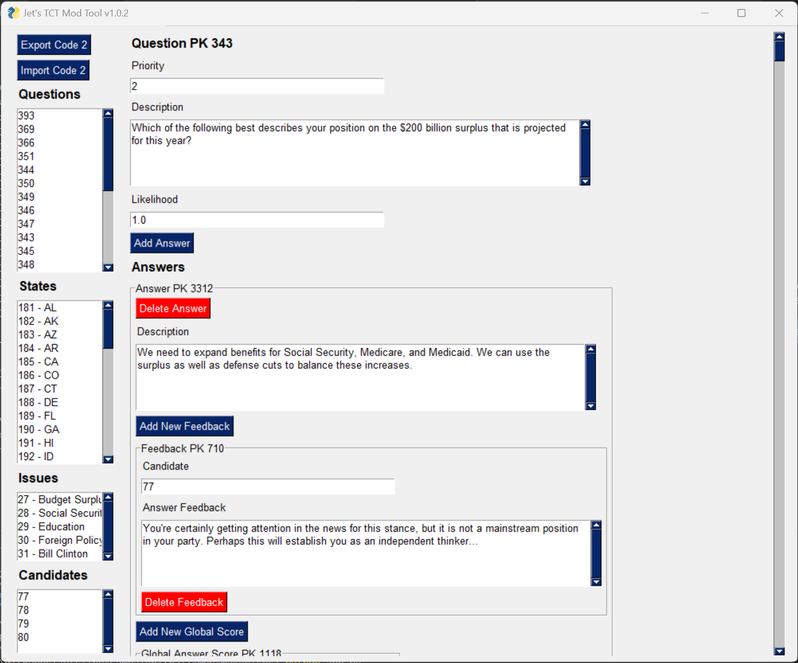

# Jet's The Campaign Trail Mod Tool

**NOTE: This is now deprecated. [Use the online version instead.](https://github.com/JetSimon/Jets-The-Campaign-Trail-Mod-Tool-Website)**

This is a graphical mod creation tool for [The Campaign Trail](https://www.americanhistoryusa.com/campaign-trail/).

Currently it supports importing code 2 files and then exporting them to share with others. If you do not have a code 2 to base off of, you can find them in the modding community or use [one I have here](https://raw.githubusercontent.com/JetSimon/Jets-The-Campaign-Trail-Mod-Tool/main/src/default_code2.js) as a default.

Features

* You (should) be able to import any existing code 2 and keep working off of it. If yours doesn't work please let me know so I can make it work! I've tested on ~10 and they work.
* Complete GUI interface - no coding strictly required
* Ability to add and delete answers and provides a centralized place to modify answer effects and feedback without flipping around files
* Change state margins
* Change issue effects
* Generates new PKs automatically
* Export and share

What this modding tool CANNOT do (yet):

* Code 1 creation (though this part is generally seen as the “easier” part of modding, so I think you guys got this!)
* Does not support CYOA, custom endings, or any other mods that involve custom JavaScript
* Does not add any aesthetic changes to the end of code 2. You’ll have to add those manually after export.

You can download here on GitHub in the “releases” folder.

If you have any issues report them on the GitHub in the issues tab.

Happy mod making,

Jet

